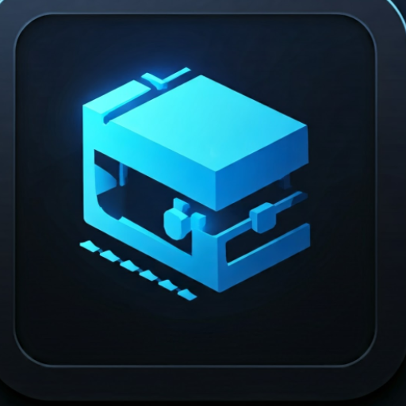
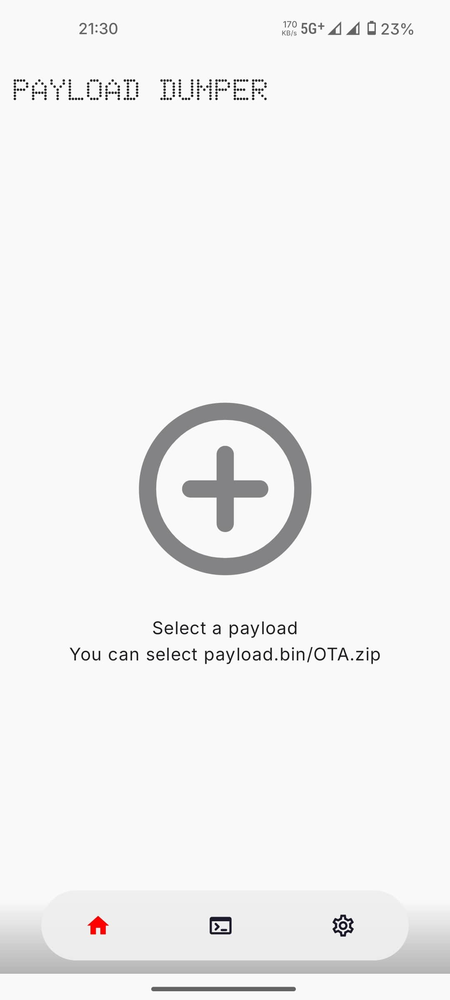
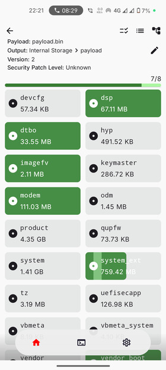
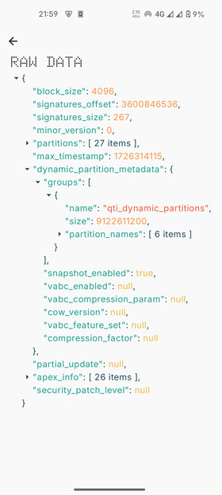
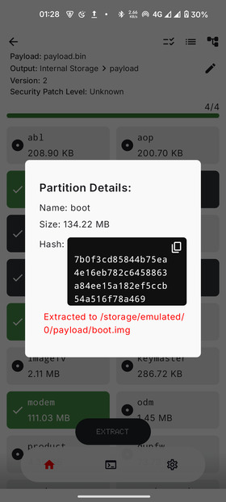
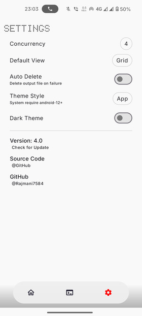
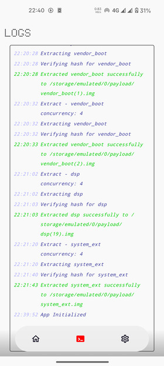

# Payload-Dumper-Android
 

### A powerful OTA extractor app for Android

### You can extract images (boot, vendor_boot...) from a payload.bin or OTA.zip **directly on Android**.

Should work on all Android ROMs that follow Google's ChromeOS update engine.

## Features & roadmap

### Completed features
- ✅ **Progress bar** - displays real-time extraction progress
- ✅ **Integrity check** - hash verification for extracted images
- ✅ **Multi-architecture support** - expanded compatibility
- ✅ **Zip file extraction** - extract directly from OTA zip files
- ✅ **Raw data view** - option to inspect raw extracted data
- ✅ **Debug logging** - enhanced troubleshooting and debugging
- ✅ **Incremental detection** - identifies incremental OTAs (extraction not supported yet!)

### Upcoming features
- ⏳ **Parallel extraction** - allow selecting additional images while extraction is in progress
- ⏳ **Cancel extraction** - option to abort an ongoing extraction process

## Screenshots

  
  
  
  
  
  

## Credits
- [payload-dumper-android-rust](https://github.com/rajmani7584/payload-dumper-android-rust) - Core native library powering the app
- [Doto Font](https://fonts.google.com/specimen/Doto) - Dotted font used in the UI
- [JsonTree](https://github.com/snappdevelopment/JsonTree) - JSON tree visualization

---
### Contributing
Contributions are welcome!
Feel free to open an issue or submit a pull request to enhance the project.

### License
This project is licensed under the GPL-3.0 license.

