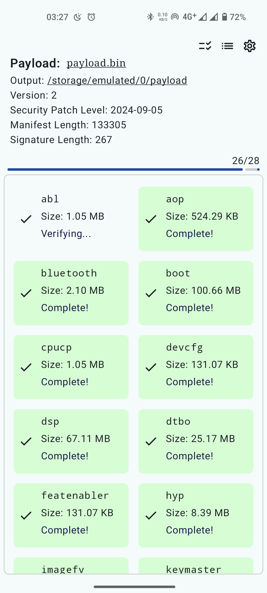
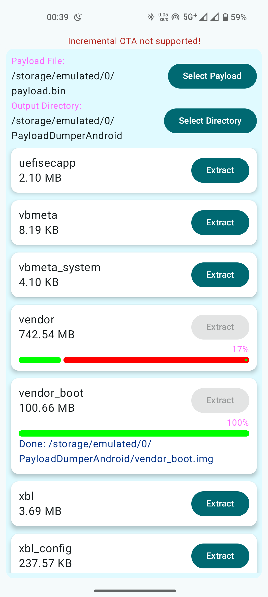
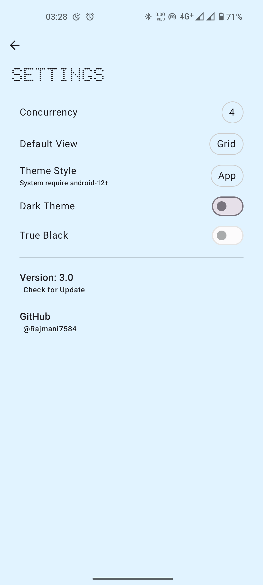

### Payload-Dumper-Android
 

### An OTA Extractor App for Android

### Screenshot:

  
  
  

### Tested on <a href="https://www.projectmatrixx.org/">MatrixxOS</a> for Nothing Phone 1 (Spacewar)

## # TODO
+ <s>Add progress bar</s> (Added)
+ <s>Add hashing to check extracted images integrity</s> (Added)
+ <s>Add more architectures</s> (Added)
+ <s>Add support to extract from zip file (currently payload.bin only is supported)</s> (Added)

## Credit
+ https://github.com/rajmani7584/payload-dumper-android-rust - native library
+ https://github.com/ssut/payload-dumper-go - core of library
+ https://fonts.google.com/specimen/Doto - Dotted Font