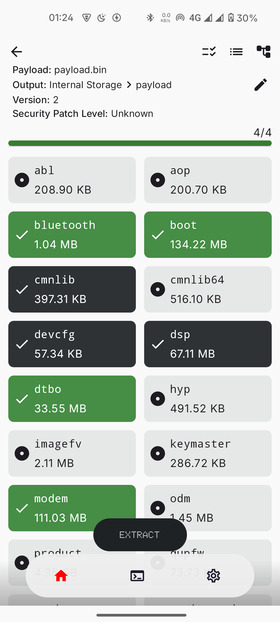

### Payload-Dumper-Android
 

### An OTA Extractor App for Android

### Tested on <a href="https://www.projectmatrixx.org/">MatrixxOS</a> for Nothing Phone 1 (Spacewar) And <a href="https://xmfirmwareupdater.com/hyperos">HyperOS</a> for nabu

## # TODO
- [x] Add progress bar (Added)
- [x] Add hashing to check extracted images integrity (Added)
- [x] Add more architectures (Added)
- [x] Add support to extract from zip file (currently payload.bin only is supported) (Added)
- [x] Add option to view raw data (Added)
- [x] Add option to Log for Debugging (Added)
- [x] Add incremental detection check (Added)
- [ ] Add an option to select more images while previous one still in progress
- [x] Add an option to cancel ongoing proccess

### Screenshots:
  
  

## Credit
+ https://github.com/rajmani7584/payload-dumper-android-rust - native library (core of the app)
+ https://fonts.google.com/specimen/Doto - Dotted Font
+ https://github.com/snappdevelopment/JsonTree - Json-Tree
