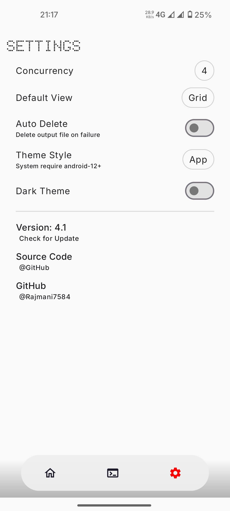

# Payload-Dumper-Android
 

### A Powerful OTA Extractor App for Android

> ### You can extract images (boot, vendor_boot...) from a OTA.zip `without a PC`, `directly on Android`, `without root access`.

## Supported Devices
Tested on:
- Spacewar
- Nabu
- OnePlus

Should work on all Android ROMs that follow Google's ChromeOS update engine.

## Features & Roadmap

### Completed Features
- ✅ **Progress Bar** - Displays real-time extraction progress
- ✅ **Integrity Check** - Hash verification for extracted images
- ✅ **Multi-Architecture Support** - Expanded compatibility
- ✅ **ZIP File Extraction** - Extract directly from OTA zip files
- ✅ **Raw Data View** - Option to inspect raw extracted data
- ✅ **Debug Logging** - Enhanced troubleshooting and debugging
- ✅ **Incremental Detection** - Identifies and handles incremental OTAs

### Upcoming Features
- ⏳ **Parallel Extraction** - Allow selecting additional images while extraction is in progress
- ⏳ **Cancel Extraction** - Option to abort an ongoing extraction process

## Screenshots

  
  
  
  
  
  

## Credits
- [payload-dumper-android-rust](https://github.com/rajmani7584/payload-dumper-android-rust) - Core native library powering the app
- [Doto Font](https://fonts.google.com/specimen/Doto) - Dotted font used in the UI
- [JsonTree](https://github.com/snappdevelopment/JsonTree) - JSON tree visualization

---
### Contributing
Contributions are welcome! Feel free to open an issue or submit a pull request to enhance the project.

### License
This project is licensed under the MIT License.

